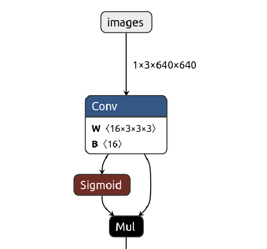
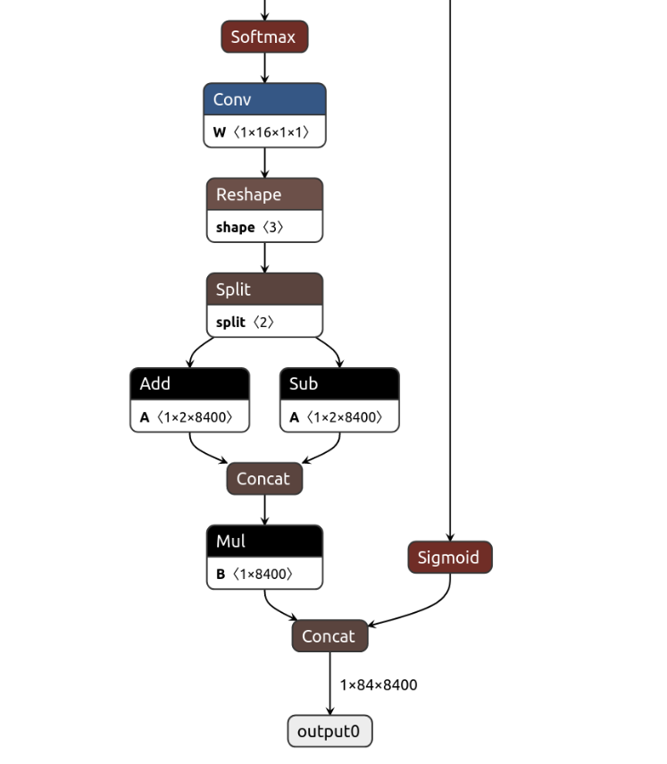
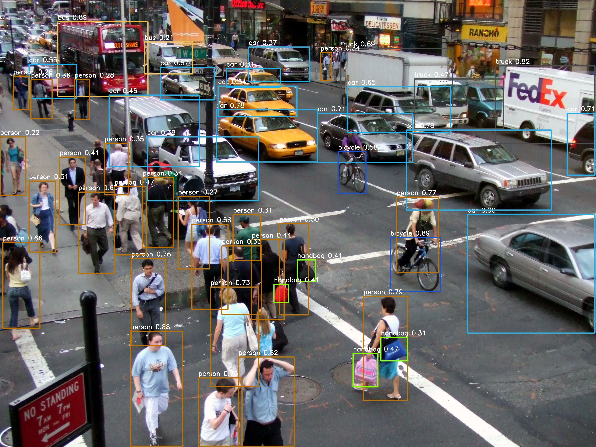
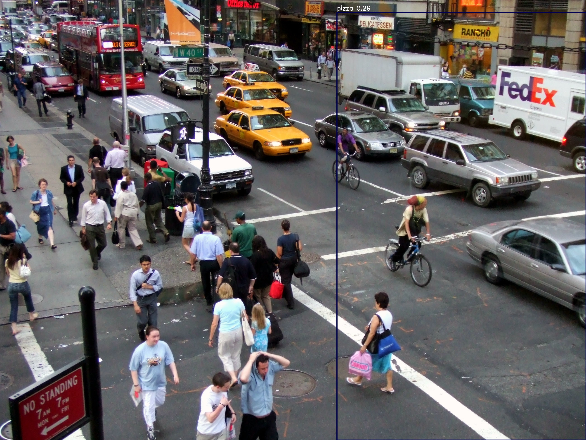

# stereolabs
Here is my submission for the technical test.

### Dependencies
- TensorRT >= 10.2.0
- CUDA >= 11.8
- Opencv >= 4.8.0

### Build
(Optional) build the docker image to avoid managing dependencies

```bash
docker build -t stereolabs . # might takes a long time bc of the opencv build (~1h on my modest machine)
docker run --gpus all -it --name stereolabs -v /local/folder:/workspace/stereolabs stereolabs
```

```bash
mkdir build && cd build
cmake .. 
make -j4
```

### Usage
```bash
Usage: stereolabs [options]
Options: 
  --video <path>          Run inference on video and save it as 'detection_output.avi'.
  --image <path>          Run inference on image and save it as 'detection_output.jpg'.
  --build <precision>     Specify precision optimization (e.g., fp32, fp12 or int8).
  --timing                Enable timing information.

Example:
  ./stereolabs --build fp16 --video ../samples/video.mp4 --timing
```

### Model
I chose to work on objects detection because this is a crucial task in most of perception tasks.
YOLO (You Only Look Once) models are really good at this task and are very fast.
They provide a good balance between accuraccy and speed, which is very important when it comes to real times applications.
YOLOv8 is one of the latest and top performing detection model, it provide 5 different model sizes. For computational reasons, 
I chose to use the smallest one (YOLOv8n).

#### Input/Output Format
The model takes an input tensor of dimension `[batch_size, 3, 640, 640]`. Where batch size is usefull when processing multiple images at the time,
3 is the channels number and 640x640 is the image dimension. The images have to be in RGB too. It is therefore necessary to preprocess the image before
feeding it into the network.

The model output a tensor of dimension `[batch_size, 84, 8400]`. Where 84 is `[x1,y1,x2,y2 + 80 classes scores]`, `(x1,y1)` top left corner and `(x2,y2)` bottom right corner of the bouding box. There is 80 possible classes so 80 probabilites which sums to 1.
The last dimension is the number of anchors, which are all the detected object at different scales. Therefore, we need to postprocess the ouput to reduce the number of detected objects, especially by performing Non Max Suppression (NMS) to get rid of overlapping bounding boxes.

The following image illustrates the input and output :


 

### Results
I took advantage of the TensorRT library and used reduced precision (`fp32`, `fp16` and `int8`) inference to reduced inference time.
fp16 was actually almost 66% times faster on my machine (Tesla T4) while mainting good results. The int8 inference was even faster.
However, the results were totally wrong. This is probably due to the fact that int8 quantization requires calibration, but I only had 5 images at my disposal and limited computing resources.

The following table summarize some benchmarks I've made on my machine (Tesla T4) with warmups etc :

| fp32 | fp16 | int8 |
| :--- | :--: | ----:|
| 18ms | 12ms | 10ms |

`fp32` results :


`fp18` results :


`int8` results :


The model had also no problem to run on a video :


